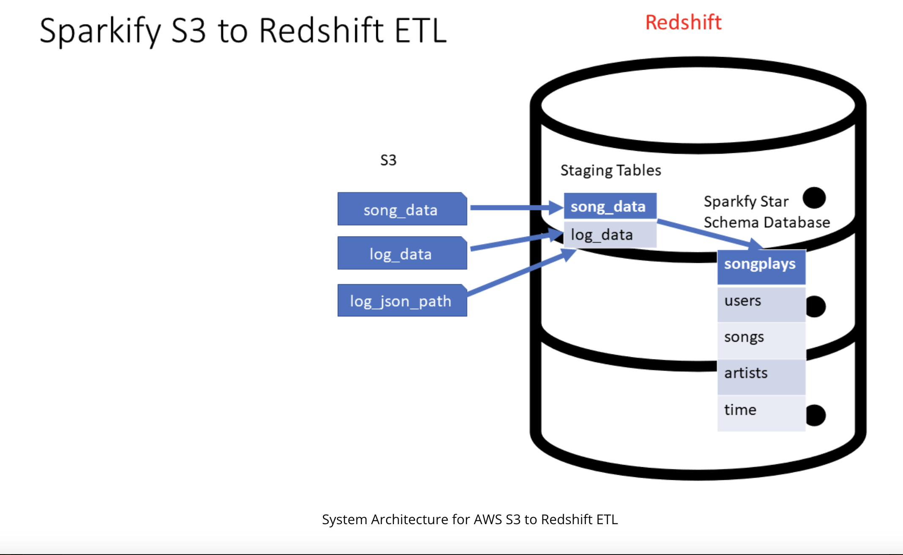
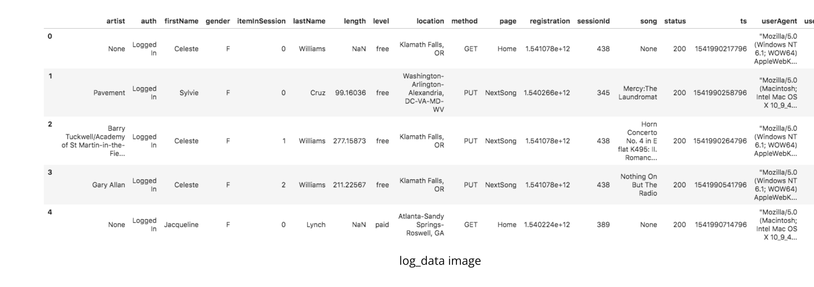
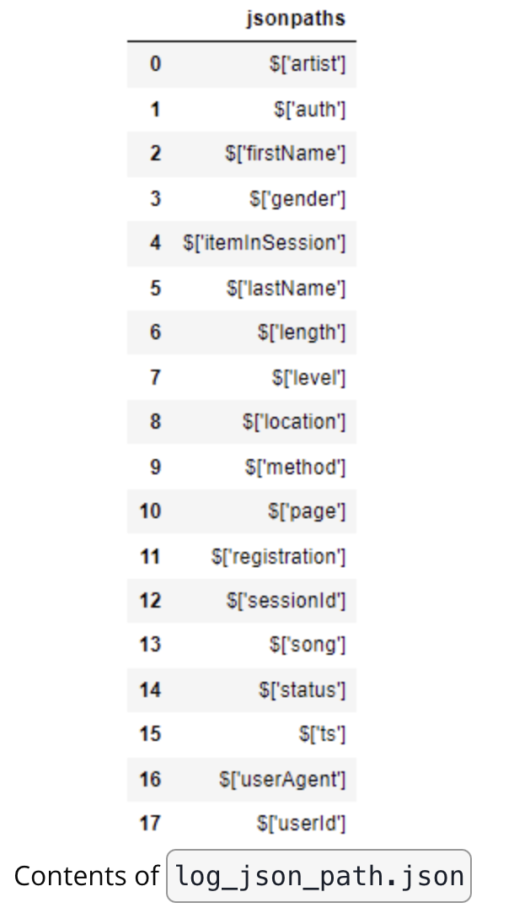
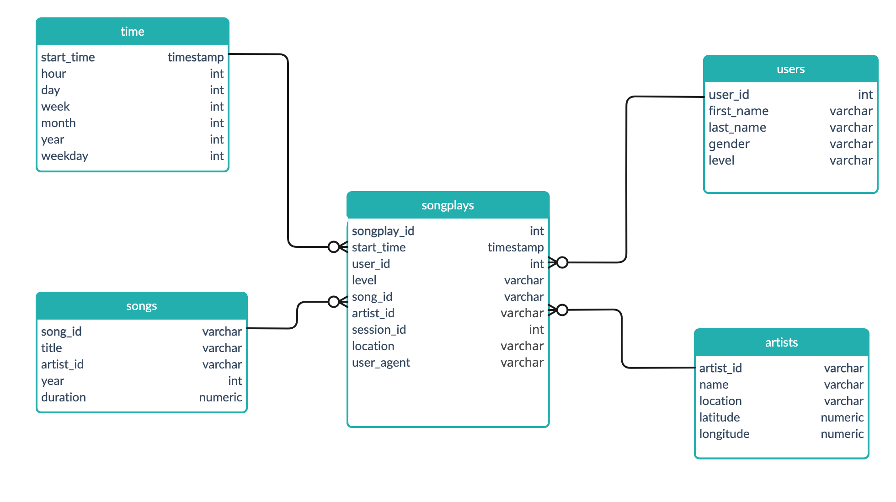

## Introduction
A music streaming startup, Sparkify, has grown their user base and song database and want to move their processes and data onto the cloud. Their data resides in S3, in a directory of JSON logs on user activity on the app, as well as a directory with JSON metadata on the songs in their app.

As their data engineer, you are tasked with building an ETL pipeline that extracts their data from S3, stages them in Redshift, and transforms data into a set of dimensional tables for their analytics team to continue finding insights into what songs their users are listening to.



## Project Dataset

### Song Dataset
The first dataset is a subset of real data from the [Million Song Dataset](http://millionsongdataset.com/). Each file is in JSON format and contains metadata about a song and the artist of that song. The files are partitioned by the first three letters of each song's track ID. For example, here are file paths to two files in this dataset.

```
song_data/A/B/C/TRABCEI128F424C983.json
song_data/A/A/B/TRAABJL12903CDCF1A.json
```
And below is an example of what a single song file, TRAABJL12903CDCF1A.json, looks like.

```
{"num_songs": 1, "artist_id": "ARJIE2Y1187B994AB7", "artist_latitude": null, "artist_longitude": null, "artist_location": "", "artist_name": "Line Renaud", "song_id": "SOUPIRU12A6D4FA1E1", "title": "Der Kleine Dompfaff", "duration": 152.92036, "year": 0}

```

### Log Dataset
The second dataset consists of log files in JSON format generated by this [event simulator](https://github.com/Interana/eventsim) based on the songs in the dataset above. These simulate app activity logs from an imaginary music streaming app based on configuration settings.

The log files in the dataset you'll be working with are partitioned by year and month. For example, here are file paths to two files in this dataset.

```
log_data/2018/11/2018-11-12-events.json
log_data/2018/11/2018-11-13-events.json
```
And below is an example of what the data in a log file, 2018-11-12-events.json, looks like.



### Log JSON Metadata
The log_json_path.json file is used when loading JSON data into Redshift. It specifies the structure of the JSON data so that Redshift can properly parse and load it into the staging tables.

In the context of this project, you will need the log_json_path.json file in the COPY command, which is responsible for loading the log data from S3 into the staging tables in Redshift. The log_json_path.json file tells Redshift how to interpret the JSON data and extract the relevant fields. This is essential for further processing and transforming the data into the desired analytics tables.

Below is what data is in log_json_path.json.




## Database Design
There are two major table categories in the database design:
- Staging tables: Data is copied from S3 to staging tables
- Analytics tables: Data is copied from staging tables to analytics tables

### Staging tables
There are two staging tables used:
- staging_events: Keeps a copy of the data from the log dataset
- staging_songs: Keeps a copy of the data from the song dataset

### Schema for Song Play Analysis
The analyitcs table makes use of a star schema as explained below
- **Fact Table**
    - songplays - records in event data associated with song plays i.e. records with page NextSong. 
        - songplay_id, start_time, user_id, level, song_id, artist_id, session_id, location, user_agent
- **Dimension Tables**
    - users in the app
        - user_id, first_name, last_name, gender, level
    - songs - songs in music database
        - song_id, title, artist_id, year, duration
    - artists - artists in music database
        - artist_id, name, location, latitude, longitude
    - time - timestamps of records in songplays broken down into specific units
        - start_time, hour, day, week, month, year, weekday

The star schema ERD diagram is shown below:


### CREATING TABLES
The ```create_tables.py``` file contains the logic for creating the staging and analytics tables. Tables are usually dropped if they already exists before they are recreated. 
The ```sql_queries.py``` file holds variables for query parameters mostly table names and SQL ETL

### ETL
The ```etl.py``` file contains the logic for loading the staging and analytics tables. Data is copied from S3 dataset to staging tables. Analytics table use SQL ETL to load data from the staging tables using JOINS when needed.


### TESTING IMPLEMENTATION
A jupyter notebook called ```sparkify_etl_pipeline``` has been provided to test how to connect the dots. User access key is not included in the config file. 
You will need to create an IAM USER with administrative privilege to be able to access the aws resources used in the test file. Generate an access key and a secret for the sser and update the config file with those parameters. To grant a user an administrative privilege, attach an AdministratorAccess policy to the user.


